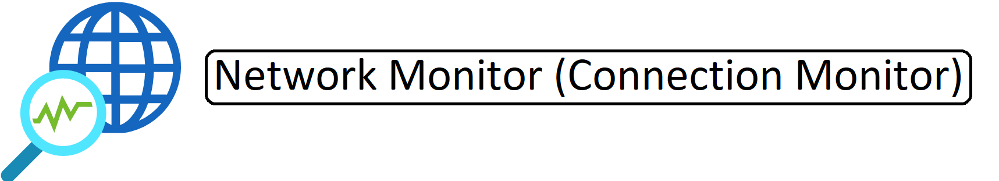

# Active Directory Multi-Site

This Template deploys a the following:

- 1 - Log Analytics Workspace
- 1 - Network Watcher (Connection Monitor)
- 2 - Virtual Networks
- 1 - Bastion Host
- 2 - Virtual Machines (Connected to Log Analytics Workspace)(Destination IIS Server)

Parameters that support changes
- ResourceGroup.  Enter the name for the Resource Group to deploy Resources.
- Location2. Enter a Valid Azure Region based on which Cloud (AzureCloud, AzureUSGovernment, etc...) you are using.
- WorkspaceLocation. (Azure Government Only Parameter) Enter a Valid Azure Region for your Log Analytics Workspace based on which Cloud (AzureCloud, AzureUSGovernment, etc...) you are using. 
- Admin Username.  Enter a valid Admin Username
- Admin Password.  Enter a valid Admin Password
- WindowsServerLicenseType.  Choose Windows Server License Type (Example:  Windows_Server or None)
- Naming Convention. Enter a name that will be used as a naming prefix for (Servers, VNets, etc) you are using.
- Vnet1ID.  Enter first 2 octets of your desired Address Space for Virtual Network 1 (Example:  10.1)
- Vnet2ID.  Enter first 2 octets of your desired Address Space for Virtual Network 2 (Example:  10.2)
- VM1OSVersion.  Select 2016-Datacenter (Windows 2016) or 2019-Datacenter (Windows 2019) VM 1 OS Version
- VM2OSVersion.  Select 2016-Datacenter (Windows 2016) or 2019-Datacenter (Windows 2019) VM 2 OS Version
- VM1VMSize.  Enter a Valid VM Size based on which Region the VM is deployed.
- VM2VMSize.  Enter a Valid VM Size based on which Region the VM is deployed.
- roleAssignmentGuid.  A new GUID used to identify the role assignment.
- UniqueID. Enter a valid identifier for your Log Analytics Workspace.