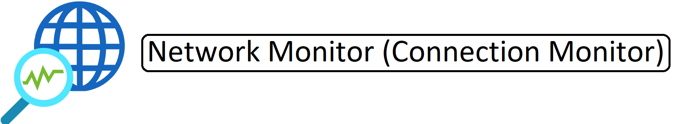

# Collection of Labs to Deploy within Azure for Self-Study or Proof Of Concept

# Active Directory Single-Site

# Active Directory Multi-Site

# Active Directory Child-Domain

# Azure Network Watcher Connection Monitor

